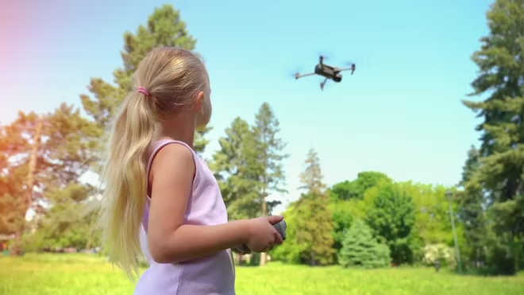

# Drones

## Introduction

**Drones are popping up everywhere these days**—whether it's for fun, work, or even secret spy missions! If you’re a high school student thinking about becoming a future tech wizard, engineer, or inventor, you’ll want to know all about the different kinds of drones, what they do, and how they’re changing the world. 

**So, let's dive in!** We'll check out the **coolest types of drones**, discover **all the surprising ways they're being used today**, and wrap things up with **a list of fancy words** that sound complicated but are actually pretty neat once you know what they mean. 

**Ready for takeoff? Let’s go!**

## Types of Drones

1. **Multi-Rotor Drones**

   

   Multi-rotor drones are the most common type of drones used today. They have multiple rotors—usually four, six, or eight—that provide lift and maneuverability. These drones can hover in place, fly in any direction, and are easy to control, making them ideal for beginners. Their ability to perform vertical take-offs and landings (VTOL) allows them to operate in confined spaces. However, they have limited flight time and speed due to high energy consumption.

2. **Fixed-Wing Drones**

   

   Fixed-wing drones resemble traditional airplanes with wings that generate lift as they move forward. They are efficient for long-distance flights and can cover large areas, making them suitable for mapping and surveying. Fixed-wing drones require runways or catapults for take-off and cannot hover in place. They have longer flight times compared to multi-rotor drones but are more complex to operate.

3. **Single-Rotor Helicopter Drones**

   

   Single-rotor drones operate like helicopters with one large rotor and a smaller tail rotor for stability. They can be powered by gas engines, providing longer flight times and the ability to carry heavier payloads. These drones are efficient and can hover, but they require more skill to fly and present greater risks due to the large spinning blades.

4. **Fixed-Wing Hybrid VTOL Drones**

   

   Hybrid drones combine the features of fixed-wing drones and multi-rotor drones. They can take off and land vertically like a helicopter and transition to fixed-wing flight for greater speed and efficiency. This versatility makes them suitable for various applications, including surveillance and delivery, without the need for runways.

5. **Small Drones (Nano/Micro Drones)**

   

   Small drones are compact and lightweight, often fitting in the palm of your hand. They are used for indoor reconnaissance, educational purposes, and research. Their small size allows them to navigate through tight spaces and operate discreetly. However, they have limited flight time and are affected by wind and weather conditions.

6. **Tactical Drones**

   

   Tactical drones are designed for military and law enforcement use. They provide real-time intelligence, surveillance, and reconnaissance (ISR) capabilities on the battlefield or in security operations. Equipped with advanced sensors and communication systems, they enhance situational awareness and decision-making processes.

7. **High-Altitude Long Endurance (HALE) Drones**

   

   HALE drones are large UAVs capable of flying at high altitudes for extended periods. They are used for persistent surveillance, environmental monitoring, and communication relay. Their long endurance allows them to stay airborne for days, covering vast areas without the need for frequent landings.

## Main Use Cases of Drones

1. **Aerial Photography and Videography**

   

   Drones have transformed photography and filmmaking by providing affordable access to aerial perspectives. They capture stunning images and videos for movies, real estate, weddings, and journalism. Drones offer unique angles and can reach places that are difficult or dangerous for humans.

   *Usable Drone Types:* Multi-Rotor Drones, Fixed-Wing Hybrid VTOL Drones, Small Drones.

2. **Agriculture and Farming**

   

   In agriculture, drones help monitor crop health, soil conditions, and irrigation efficiency. Equipped with multispectral sensors, they provide data for precision farming, allowing farmers to optimize resources and increase yields. Drones can also spray fertilizers and pesticides precisely over fields.

   *Usable Drone Types:* Fixed-Wing Drones, Multi-Rotor Drones, Fixed-Wing Hybrid VTOL Drones.

3. **Search and Rescue Operations**

   

   Drones assist in search and rescue missions by covering large areas quickly and accessing hard-to-reach locations. They can be equipped with thermal cameras to detect heat signatures of missing persons or survivors in disaster zones. Drones enhance the effectiveness and safety of rescue teams.

   *Usable Drone Types:* Multi-Rotor Drones, Single-Rotor Helicopter Drones, Small Drones.

4. **Environmental Monitoring and Research**

   

   Scientists use drones to study wildlife, monitor deforestation, and collect data on climate change. Drones can track animal migrations, assess environmental damage, and sample air or water quality without disturbing natural habitats.

   *Usable Drone Types:* Fixed-Wing Drones, Multi-Rotor Drones, HALE Drones.

5. **Infrastructure Inspection**

   

   Drones inspect bridges, buildings, power lines, and wind turbines, reducing the need for manual inspections in dangerous locations. High-resolution cameras and sensors detect structural issues early, saving time and reducing costs associated with maintenance.

   *Usable Drone Types:* Multi-Rotor Drones, Single-Rotor Helicopter Drones.

6. **Delivery Services**

   

   Companies are exploring drone delivery for packages, medical supplies, and food. Drones can reduce delivery times, especially in remote or congested areas. Challenges include airspace regulations and ensuring safe operations in populated regions.

   *Usable Drone Types:* Fixed-Wing Hybrid VTOL Drones, Multi-Rotor Drones.

7. **Military and Defense Applications**

   

   The military uses drones for surveillance, reconnaissance, target acquisition, and even combat missions. Drones reduce the risk to personnel and provide valuable intelligence. Advanced models can carry weapons and operate autonomously.

   *Usable Drone Types:* Tactical Drones, HALE Drones, Fixed-Wing Drones.

8. **Mapping and Surveying**

   

   Drones create detailed maps and 3D models for urban planning, construction, and archaeology. They collect accurate data quickly, covering areas that may be inaccessible or hazardous for humans.

   *Usable Drone Types:* Fixed-Wing Drones, Fixed-Wing Hybrid VTOL Drones, Multi-Rotor Drones.

9. **Disaster Management**

   

   In the aftermath of natural disasters, drones assess damage, locate survivors, and deliver essential supplies. They provide real-time information to emergency responders, improving coordination and response times.

   *Usable Drone Types:* Multi-Rotor Drones, Small Drones, Fixed-Wing Drones.

10. **Recreational Use**

    

    Hobbyists fly drones for fun, racing, or capturing personal aerial footage. Drone racing leagues have emerged, where pilots navigate courses at high speeds using FPV systems. This promotes interest in technology and aviation among young people.

   *Usable Drone Types:* Multi-Rotor Drones, Small Drones.

## Vocabulary

- **UAV (Unmanned Aerial Vehicle):** An aircraft operated without a human pilot onboard, controlled remotely or autonomously.

- **FPV (First Person View):** A method of controlling a drone using a live video feed from an onboard camera, giving the pilot a cockpit perspective.

- **Geomapping:** The process of creating maps by analyzing geographic data collected by drones, often used in surveying and agriculture.

- **VTOL (Vertical Take-Off and Landing):** The ability of an aircraft to take off, hover, and land vertically.

- **Payload:** The cargo or equipment carried by a drone, such as cameras, sensors, or delivery packages.

- **Multispectral Sensor:** A device that captures image data within specific wavelength ranges, used for analyzing crop health and environmental conditions.

- **Endurance:** The maximum time a drone can remain airborne on a single flight.

- **Autonomous Flight:** When a drone operates without human control, following pre-programmed instructions or using onboard sensors.

- **LiDAR (Light Detection and Ranging):** A remote sensing technology that measures distances by illuminating a target with laser light and analyzing the reflection, used for mapping and navigation.

- **Drone Swarm:** A group of drones operating together in a coordinated manner to perform tasks more efficiently.

- **Telemetry:** The transmission of data from the drone to a ground station, including position, speed, and system status.

- **Flight Controller:** The onboard computer that manages a drone's flight dynamics and stability.

- **Obstacle Avoidance:** Systems that allow drones to detect and navigate around obstacles automatically.

- **Return-to-Home (RTH):** A safety feature where the drone automatically returns to its take-off point, often activated when the battery is low or the control signal is lost.

- **No-Fly Zone:** Areas where drone flights are restricted or prohibited, such as near airports or military bases.

- **GIS (Geographic Information System):** A framework for gathering, managing, and analyzing spatial and geographic data.

- **Firmware:** The software programmed into the drone's hardware that controls its functions and behaviors.

- **Regulations/Airspace Management:** Legal requirements governing where and how drones can be operated to ensure safety and privacy.

- **Propulsion System:** The components that move the drone forward, including motors, propellers, and power sources.

- **Ground Control Station (GCS):** The interface used by the pilot to control the drone, which may include a computer, tablet, or specialized remote controller.
